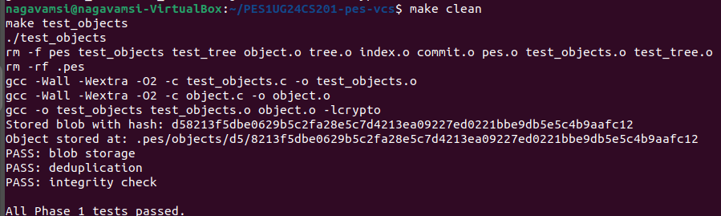
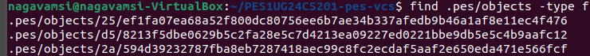
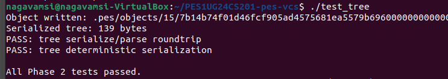
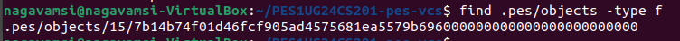
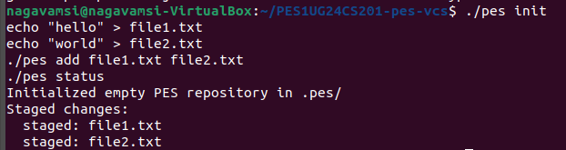
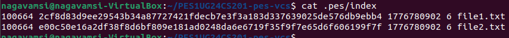
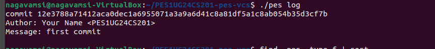
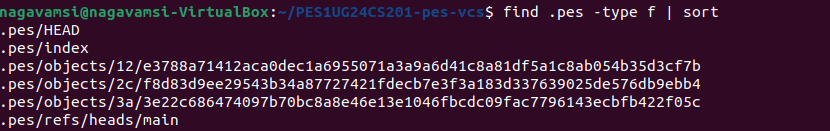

# Building PES-VCS — A Version Control System from Scratch

**Name:** JINKA NAGA VAMSI
**SRN:** PES1UG24CS201
**Platform:** Ubuntu 22.04

---

## 🚀 Overview

PES-VCS is a simplified version control system inspired by Git.
It implements core concepts like:

* Content-addressable storage (objects)
* Tree-based directory structure
* Index (staging area)
* Commit history (linked structure)

---

# 📸 Screenshots

## 🔹 Phase 1: Object Storage

### 1A — Test Objects Output


### 1B — Object Store Structure


---

## 🔹 Phase 2: Tree Objects

### 2A — Tree Test Output



### 2B — Raw Tree Object (Binary View)



---

## 🔹 Phase 3: Index (Staging Area)

### 3A — Init + Add + Status



### 3B — Index File Content



---

## 🔹 Phase 4: Commits and History

### 4A — Commit Log



### 4B — Object Store Growth



### 4C — HEAD and Branch Reference


---

# 🛠 Commands Used

```bash
make
./pes init
echo "hello" > file1.txt
echo "world" > file2.txt
./pes add file1.txt file2.txt
./pes commit -m "first commit"
./pes log
```

---

# 🧠 Analysis Questions

## Q5.1 — Branching and Checkout

A branch is a file inside `.pes/refs/heads/` storing a commit hash.

To implement `pes checkout <branch>`:

* Update `.pes/HEAD`
* Read commit hash from branch
* Load corresponding tree
* Replace working directory

Complexity:

* Handling uncommitted changes
* Avoiding data loss

---

## Q5.2 — Dirty Working Directory Detection

Steps:

* Compare working directory with index
* Detect modified or missing files
* If conflict with target branch → abort checkout

---

## Q5.3 — Detached HEAD

Detached HEAD occurs when HEAD points directly to a commit.

Effects:

* Commits are not attached to a branch

Recovery:

* Create a new branch pointing to that commit

---

## Q6.1 — Garbage Collection

Steps:

1. Traverse from all branch heads
2. Mark reachable objects
3. Delete unreferenced objects

Data structure:

* Hash set

---

## Q6.2 — GC Race Condition

Problem:

* GC deletes objects while commit is being created

Solution:

* Use locks
* Use temporary files
* Ensure safe commit completion before cleanup

---

# ✅ Final Status

✔ Phase 1 Completed
✔ Phase 2 Completed
✔ Phase 3 Completed
✔ Phase 4 Completed

---

# 🎯 Conclusion

This project demonstrates:

* File system design concepts
* Hash-based storage
* Tree structures for directories
* Linked commits for history

PES-VCS successfully replicates core Git functionality at a low level.

---

# 📦 How to Run

```bash
make
./pes init
./pes add <files>
./pes commit -m "message"
./pes log
```

---

# ⚠️ Note

Make sure screenshots (`.png` files) are in the same directory as this README file for proper display on GitHub.

---
